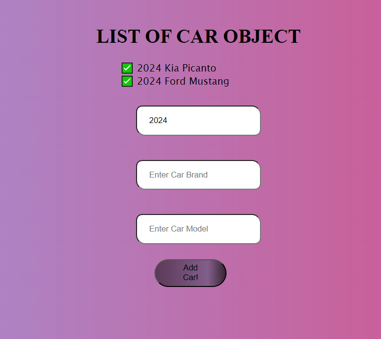

# List of Car Object

This project is a simple React application that allows users to add car objects to a list. Each car object consists of the year, make, and model of the car. Users can input these details and add them to the list by clicking the "Add Car!" button.

## Getting Started

To get started with this project, you can follow these steps:

1. Clone this repository to your local machine.
2. Navigate to the project directory.
3. Install dependencies by running `npm install`.
4. Start the development server by running `npm start`.
5. Open [http://localhost:3000](http://localhost:3000) to view it in the browser.

## Usage

Once the development server is running, you can access the application in your web browser. Enter the year, make, and model of a car into the input fields, and click the "Add Car!" button to add it to the list. The list will display all the cars you have added with their details.

